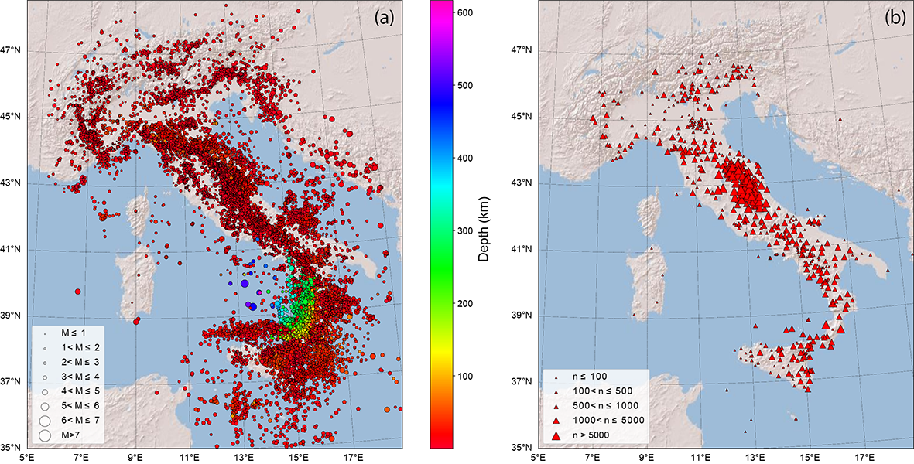
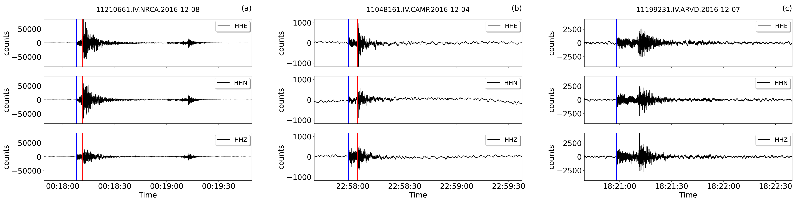
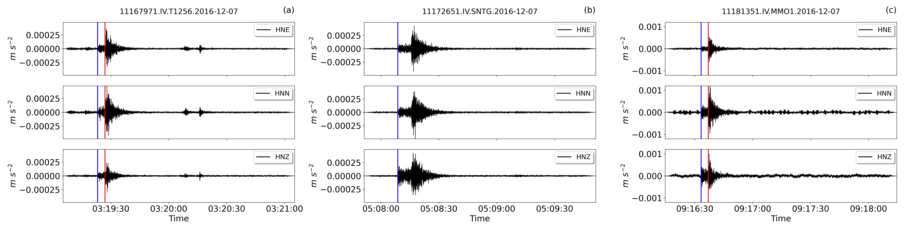
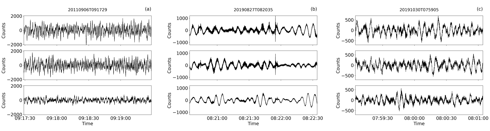

[](https://doi.org/10.13127/instance)


## Description
**INSTANCE** is a dataset of seismic waveforms data and associated metadata **suited for analysis based on machine learning**. It includes:
* 54,008 earthquakes for a total of 1,159,249 3-channel waveforms;
* 132,330 3-channel noise waveforms;
* 116 precomputed observable quantities providing information on *station, trace source, path* and *quality*;
* 19 networks;
* 620 seismic stations.



*Earthquakes a) and stations b) of the dataset. Symbols size are proportional to earthquake magnitude and number of arrival phases recorded by stations, respectively*

To **access the waveforms in INSTANCE** we provide the notebook Waveforms.ipynb.

**Events with Magnitude in the range [2-4]**

**Events selected from HN channel**

**Noise selected form HH channel**



## Reference
INSTANCE The Italian Seismic Dataset For Machine Learning,
Alberto Michelini, Spina Cianetti, Sonja Gaviano, Carlo Giunchi, Dario Jozinović & Valentino Lauciani,
Seismic Waveforms And Associated Metadata published 2021 in Istituto Nazionale di Geofisica e Vulcanologia (INGV) https://doi.org/10.13127/instance

## Download
To get the **full dataset** you have to download:

* Noise metadata ([**csv**](http://repo.pi.ingv.it/instance/metadata_Instance_noise.csv.bz2), 8 MB)
* Noise data in counts ([**hdf5**](http://repo.pi.ingv.it/instance/Instance_noise.tar.bz2), 3.9 GB)

* Events metadata ([**csv**](http://repo.pi.ingv.it/instance/metadata_Instance_events.csv.bz2), 249 MB)
* Events data in counts  as [**single hdf5 file**](http://repo.pi.ingv.it/instance/Instance_events_counts.tar.bz2) (39 GB) or 10 GB parts ([**part-a**](http://repo.pi.ingv.it/instance/Instance_events_counts.tar.bz2.part-a), [**part-b**](http://repo.pi.ingv.it/instance/Instance_events_counts.tar.bz2.part-b), [**part-c**](http://repo.pi.ingv.it/instance/Instance_events_counts.tar.bz2.part-c), [**part-d**](http://repo.pi.ingv.it/instance/Instance_events_counts.tar.bz2.part-d))

* Events data in ground motion units as [**single hdf5 file**](http://repo.pi.ingv.it/instance/Instance_events_gm.tar.bz2) (307 GB) or
20 GB parts ([**part-a**](http://repo.pi.ingv.it/instance/Instance_events_gm.tar.bz2.part-a),
[**part-b**](http://repo.pi.ingv.it/instance/Instance_events_gm.tar.bz2.part-b),
[**part-c**](http://repo.pi.ingv.it/instance/Instance_events_gm.tar.bz2.part-c),
[**part-d**](http://repo.pi.ingv.it/instance/Instance_events_gm.tar.bz2.part-d),
[**part-e**](http://repo.pi.ingv.it/instance/Instance_events_gm.tar.bz2.part-e),
[**part-f**](http://repo.pi.ingv.it/instance/Instance_events_gm.tar.bz2.part-f),
[**part-g**](http://repo.pi.ingv.it/instance/Instance_events_gm.tar.bz2.part-g),
[**part-h**](http://repo.pi.ingv.it/instance/Instance_events_gm.tar.bz2.part-h),
[**part-i**](http://repo.pi.ingv.it/instance/Instance_events_gm.tar.bz2.part-i),
[**part-j**](http://repo.pi.ingv.it/instance/Instance_events_gm.tar.bz2.part-j),
[**part-k**](http://repo.pi.ingv.it/instance/Instance_events_gm.tar.bz2.part-k),
[**part-l**](http://repo.pi.ingv.it/instance/Instance_events_gm.tar.bz2.part-l),
[**part-m**](http://repo.pi.ingv.it/instance/Instance_events_gm.tar.bz2.part-m),
[**part-n**](http://repo.pi.ingv.it/instance/Instance_events_gm.tar.bz2.part-n),
[**part-o**](http://repo.pi.ingv.it/instance/Instance_events_gm.tar.bz2.part-o),
[**part-p**](http://repo.pi.ingv.it/instance/Instance_events_gm.tar.bz2.part-p)). Ground motion units are **m/s for HH and EH channels** and **m/s<sup>2</sup> for HN channel**.

<!-- The **notebooks** provided in this repo can be used to reproduce the figures of the manuscript Michelini et al., 2021, submitted. -->

A **sample dataset** of approximately 1.7 GB is provided in the repository to run the notebooks. The sample dataset contains 10,000 events and 1000 noise waveforms together with the associated metadata. Users potentially interested can evaluate whether **INSTANCE** fulfill their needs without downloading the whole dataset.

* [**Sample dataset**](http://repo.pi.ingv.it/instance/Instance_sample_dataset.tar.bz2) (1.7 GB)


## Requirements
To run the notebooks please make sure the following packages are properly installed in your environment:
* obspy
* jupyter
* basemap
* pandas
* seaborn
* h5py
* hdf5

 or just create a dedicated environment for INSTANCE

 ```
conda create -n instance python=3.7 obspy jupyter basemap pandas seaborn h5py hdf5
conda activate instance
git clone https://github.com/cjunkk/instance
cd instance
curl http://repo.pi.ingv.it/instance/Instance_sample_dataset.tar.bz2 | tar xj
```


## Licence

Creative commons license [Attribution 4.0 International (CC BY 4.0)](https://creativecommons.org/licenses/by/4.0/legalcode)
