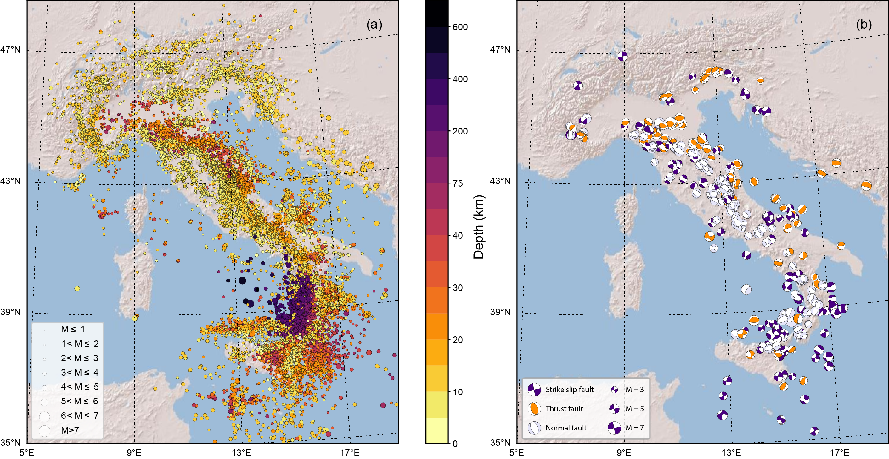

[](https://doi.org/10.13127/instance)
<!--[GitHub all releases](https://img.shields.io/github/downloads/cjunkk/instance/total?color=green&style=flat-square)-->

## Description
**INSTANCE** is a dataset of seismic waveforms data and associated metadata **suited for analysis based on machine learning**. It includes:
* 54,008 earthquakes for a total of 1,159,249 3-channel waveforms;
* 132,330 3-channel noise waveforms;
* 115 precomputed observable quantities providing information on *station, trace, source, path* and *quality*;
* 19 networks;
* 620 seismic stations.



*Earthquakes a) and stations b) in INSTANCE. Symbols size are proportional to earthquake magnitude and number of arrival phases recorded by stations, respectively*


**Events with Magnitude in the range [2-4]**

**Events selected from HN channel**

**Noise selected form HH channel**


## Open review
Michelini, A., Cianetti, S., Gaviano, S., Giunchi, C., Jozinovic, D., and Lauciani, V.: INSTANCE – the Italian seismic dataset for machine learning, Earth Syst. Sci. Data Discuss. [preprint], https://doi.org/10.5194/essd-2021-164, in review, 2021.

<!--The preprint is **open for interactive public discussion until 22 Jul 2021** at: https://essd.copernicus.org/preprints/essd-2021-164/-->

## Reference
**INSTANCE** The Italian Seismic Dataset For Machine Learning,
Alberto Michelini, Spina Cianetti, Sonja Gaviano, Carlo Giunchi, Dario Jozinović & Valentino Lauciani,
Seismic Waveforms And Associated Metadata published 2021 in Istituto Nazionale di Geofisica e Vulcanologia (INGV) https://doi.org/10.13127/instance

## Downloads
To get the **full INSTANCE dataset** you have to download:

* **Events metadata** ([**csv**](http://repo.pi.ingv.it/instance/metadata_Instance_events.csv.bz2), 238 MB bz2 file, 1.1 GB after decompression) - doi:10.13127/instance/eventsmetadata.1
* **Events data in counts**  as [**single hdf5 file**](http://repo.pi.ingv.it/instance/Instance_events_counts.hdf5.bz2) (39 GB bz2 file, 156 GB after decompression) or 10 GB parts ([**part-a**](http://repo.pi.ingv.it/instance/events/Instance_events_counts.hdf5.bz2.part-a), [**part-b**](http://repo.pi.ingv.it/instance/events/Instance_events_counts.hdf5.bz2.part-b), [**part-c**](http://repo.pi.ingv.it/instance/events/Instance_events_counts.hdf5.bz2.part-c), [**part-d**](http://repo.pi.ingv.it/instance/events/Instance_events_counts.hdf5.bz2.part-d)) - doi:10.13127/instance/events.1

* **Events data in ground motion units** as [**single hdf5 file**](http://repo.pi.ingv.it/instance/Instance_events_gm.hdf5.bz2) (151 GB bz2 file, 156 GB after decompression) or
20 GB parts ([**part-a**](http://repo.pi.ingv.it/instance/gm/Instance_events_gm.hdf5.bz2.part-a),
[**part-b**](http://repo.pi.ingv.it/instance/gm/Instance_events_gm.hdf5.bz2.part-b),
[**part-c**](http://repo.pi.ingv.it/instance/gm/Instance_events_gm.hdf5.bz2.part-c),
[**part-d**](http://repo.pi.ingv.it/instance/gm/Instance_events_gm.hdf5.bz2.part-d),
[**part-e**](http://repo.pi.ingv.it/instance/gm/Instance_events_gm.hdf5.bz2.part-e),
[**part-f**](http://repo.pi.ingv.it/instance/gm/Instance_events_gm.hdf5.bz2.part-f),
[**part-g**](http://repo.pi.ingv.it/instance/gm/Instance_events_gm.hdf5.bz2.part-g),
[**part-h**](http://repo.pi.ingv.it/instance/gm/Instance_events_gm.hdf5.bz2.part-h)). Ground motion units are m/s for HH and EH channels and m/s<sup>2</sup> for HN channel. doi:10.13127/instance/groundmotion.1
* **Noise metadata** ([**csv**](http://repo.pi.ingv.it/instance/metadata_Instance_noise.csv.bz2), 6.7 MB bz2 file, 53 MB after decompression) - doi:10.13127/instance/noisemetadata.1
* **Noise data** in counts ([**hdf5**](http://repo.pi.ingv.it/instance/Instance_noise.hdf5.bz2), 3.9 GB bz2 file, 18 GB after decompression) - doi:10.13127/instance/noise.1


* **Stations inventory** ([**StationXML**](http://repo.pi.ingv.it/instance/responses.tgz), 15 MB)

<!-- The **notebooks** provided in this repo can be used to reproduce the figures of the manuscript Michelini et al., 2021, submitted. -->
All the above downloads provide `bzip2` compressed files. The multipart files can be reassembled and then unzipped (e.g., for the event data file)

```
cat  Instance_events_counts.hdf5.bz2.part-* > Instance_events_counts.hdf5.bz2
bzip2 -d Instance_events_counts.hdf5.bz2
```

A **sample dataset** of about 1.7 GB is provided to run the notebooks. This contains 10,000 events and 1000 noise waveforms together with the associated metadata. Potentially interested users can evaluate **INSTANCE**  data and metadata without downloading the whole dataset.

* [**Sample dataset**](http://repo.pi.ingv.it/instance/Instance_sample_dataset.tar.bz2) (1.7 GB bz2 file, 2.74 GB after decompression)

## Notebooks
The following notebooks provide examples about reading waveforms and metadata of **INSTANCE**. They refers to the  **sample dataset**; to use them with the full dataset filenames must be changed accordingly.

`Plots.ipynb` to explore significant parameters distribution in **INSTANCE** using metadata

`Waveforms.ipynb` to select and plot 3 channel waveforms

`Station_Hypocenter_MomentTensor.ipynb` maps about earthquakes included in INSTANCE


## Requirements
To run the notebooks please make sure the following packages are properly installed in your environment:
* obspy
* jupyter
* basemap
* pandas
* seaborn
* h5py
* hdf5


 or just create a dedicated environment for INSTANCE

 ```
conda create -n instance python=3.7 obspy jupyter basemap pandas seaborn h5py hdf5
conda activate instance
git clone https://github.com/cjunkk/instance
cd instance
curl http://repo.pi.ingv.it/instance/Instance_sample_dataset.tar.bz2 | tar xj
```


## Licence

Creative commons license [Attribution 4.0 International (CC BY 4.0)](https://creativecommons.org/licenses/by/4.0/legalcode)
